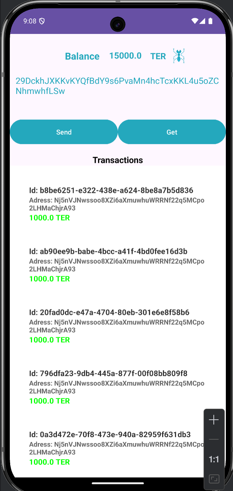
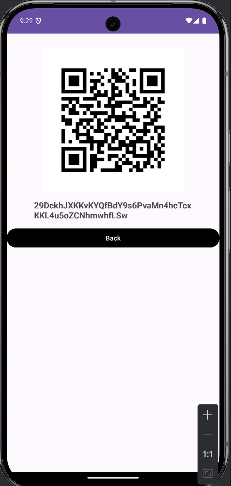
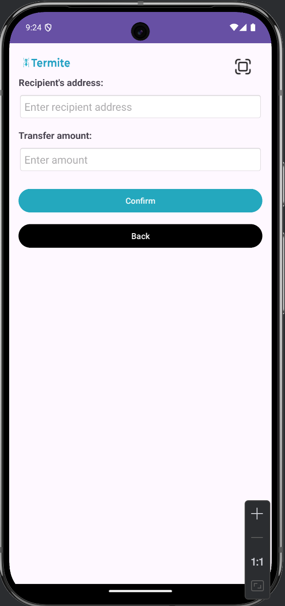

## 3.6 Mobile Application

### General Description

The **TermiteWallet** mobile application is a cryptocurrency wallet designed to work with a decentralized network. It allows users to securely manage their crypto assets and communicate with node APIs.

The application provides an intuitive and easy-to-use interface for:
- creating new wallets
- importing existing wallets
- performing transactions
- other cryptocurrency-related operations

The application is developed using **Android Studio** and written in **Java**.

### Key Features

- **Wallet Creation**  
  Generate a new cryptocurrency wallet with unique keys.

- **Wallet Import**  
  Restore an existing wallet using private keys or other recovery methods.

- **Node API Communication**  
  Connect to decentralized network nodes to:
    - send transactions
    - synchronize balances
    - retrieve network data

- **Data Security**  
  Uses modern encryption methods to protect:
    - private keys
    - user data
    - sessions

- **User Interface**  
  Simple and clear UI suitable for users with different levels of technical knowledge.

The application enables secure interaction with blockchain networks while maintaining a high level of privacy.

---

### 3.6.1 Main Features

- Connection to decentralized network nodes
- Wallet creation and recovery
- Authentication and data encryption
- Sending and receiving cryptocurrency
- Simple and user-friendly interface

**TermiteWallet** is a solid choice for users looking for a secure and easy-to-use mobile cryptocurrency wallet.

[//]: # (![termite_wallet_01.png]&#40;images/termite_wallet_01.png&#41;)

Figure 1: Termite Wallet

---

### 3.6.2 Example of Cryptocurrency Wallet Usage

A cryptocurrency wallet allows users to securely store, send, and receive digital assets.

#### Wallet Creation

The user:
1. Installs the application
2. Generates a new wallet
3. Receives:
    - a private key
    - a public key

#### Adding Funds

1. The user obtains their public address  
   (see Figure 8 under the wallet balance)
2. Shares the address with the sender
3. Another user or exchange sends funds
4. After confirmation, the balance is updated

The wallet can generate a QR code for easy address sharing.

Figure 2: Receive Screen

---

#### Sending Cryptocurrency

1. The user enters:
    - recipient address
    - amount
2. Can use a QR scanner  
   (see button in the top-right corner — Figure 9)
3. Confirms the transaction using their private key
4. The transaction is sent to the blockchain

Figure 13: Send Screen

---

#### Transaction History

The application allows users to:
- track incoming and outgoing transactions
- view transaction status
- check fees
- manage multiple assets in one interface

---

The cryptocurrency wallet gives users full control over their funds while ensuring high security and ease of use.